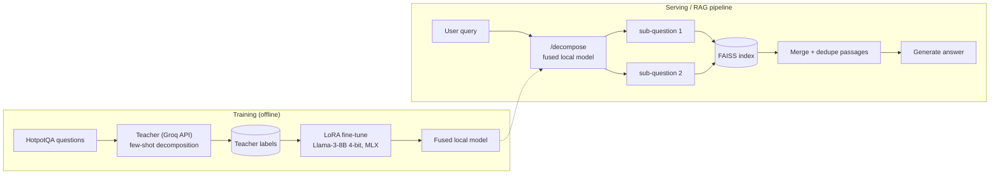

# RAG Query Decomposition via Distilled LoRA Fine-Tuning

Distilling a large teacher model's query-decomposition ability into a small,
locally fine-tuned Llama-3-8B (4-bit, MLX + LoRA) for multi-hop retrieval in RAG
pipelines, with no per-query API cost and no rate limit.

Build plan: [build-brief-query-decomposition.md](build-brief-query-decomposition.md) · Status: [PROGRESS.md](PROGRESS.md)

## Problem statement

Multi-hop questions ("What nationality is the director of the film that won X?")
often can't be answered by retrieving passages for the raw question, because no
single passage contains the full chain of facts. Decomposing the question into
atomic sub-questions and retrieving per sub-question can close this gap, but
running a frontier model on every query costs money, adds an external
dependency, and is rate limited. This project tests whether a small model
fine-tuned on a teacher's decompositions can do the job locally.

## Architecture



## Setup and results at a glance

- Student: `mlx-community/Meta-Llama-3-8B-Instruct-4bit`, LoRA via `mlx_lm.lora`
- Teacher: `qwen/qwen3.8-27b` on Groq (the brief's Llama-3-70B is no longer offered; see [docs/phase2_notes.md](docs/phase2_notes.md))
- Data: 1,338 teacher-labeled HotpotQA train questions, split 1,070 / 133 / 135 (train / valid / test)
- Retrieval: `all-MiniLM-L6-v2` embeddings, FAISS flat index over one shared corpus (1,339 unique paragraphs pooled from the test questions' contexts)
- Hardware: Apple M4 Pro, 24 GB. Training peak memory ~7.2 GB, ~40 min

## Results: Recall@k on the held-out test set (n = 135)

Recall@k = fraction of a question's 2 gold supporting paragraphs found in the top-k merged results.
Sub-question results are merged by interleaving ranks, then truncated to k.

| Approach | Recall@5 | Recall@10 |
|---|---|---|
| Raw query (floor) | 0.726 | 0.852 |
| Base Llama-3-8B, zero-shot decomposition | 0.663 | 0.782 |
| **Fine-tuned Llama-3-8B (LoRA) decomposition** | **0.700** | **0.819** |
| Teacher (Qwen3.8-27B) decomposition | 0.719 | 0.830 |

Decomposition is often used alongside the original question rather than
instead of it. Searching with the original question plus the sub-questions:

| Approach (original question + sub-questions) | Recall@5 | Recall@10 |
|---|---|---|
| Base Llama-3-8B, zero-shot | 0.726 | 0.819 |
| **Fine-tuned Llama-3-8B (LoRA)** | **0.752** | **0.852** |
| Teacher | 0.752 | 0.852 |

Raw numbers: [docs/recall_results.jsonl](docs/recall_results.jsonl).

### How to read this honestly

- **Distillation worked.** Fine-tuning lifts the student well above its zero-shot self (R@5 0.663 to 0.700, and 0.726 to 0.752 with the original question), and with the original question it exactly matches the teacher. The fine-tuned model also removes the base model's junk outputs (preambles like "Here are the atomic sub-questions:" that got embedded as queries).
- **The hypothesis holds only partly, because the teacher ceiling itself is modest.** Teacher decomposition alone does not beat the raw query on this setup (0.719 vs 0.726 at k=5). Decomposition only beats raw when combined with the original question, and then by a small margin (+2.6 points at k=5, no change at k=10).
- **The test set is small.** With 135 questions, a 2.6-point difference is about 3 to 4 questions' worth of gold paragraphs. Treat these gaps as suggestive, not conclusive; a larger test set and multiple seeds would be needed to claim significance.

## Latency and cost (30 test queries, [docs/latency_cost.json](docs/latency_cost.json))

| | Local fused 8B (MLX, M4 Pro) | Groq API (Qwen3.8-27B) |
|---|---|---|
| Mean latency | 818 ms | 221 ms |
| p50 / p95 | 783 / 1231 ms | 198 / 321 ms |
| Marginal cost per query | $0 (no API) | $0 on free tier, but capped at 1,000 requests/day; ~217 prompt + ~31 completion tokens per call |
| Rate limits | None | 1,000 requests/day, plus per-minute limits |
| Data leaves the machine | No | Yes |

The hosted API is about 3.7x **faster** per query than the local model; the
local model's advantages are cost at scale, no quota, and privacy, not speed.
Latency for the local model measured after warm-up, stopping at `<|eot_id|>`.
For a paid-API cost estimate, run `scripts/benchmark_latency.py --price-in X --price-out Y` (USD per 1M tokens).

## Hyperparameters

| | |
|---|---|
| Method | LoRA (`mlx_lm.lora`), attention q/k/v/o projections, last 16 layers |
| Rank / scale (alpha) / dropout | 16 / 32 (alpha/rank = 2) / 0.05 |
| Trainable parameters | 6.8M (0.085% of 8.03B) |
| Learning rate / batch size | 1e-5 / 4 |
| Iterations | 600 planned (about 2.2 epochs); checkpoint at iteration 300 selected |
| Max sequence length | 512, prompt tokens masked from the loss, gradient checkpointing |
| Data | 1,070 train / 133 valid / 135 test, split by question (seed 42) |

Validation loss ([docs/training_log.txt](docs/training_log.txt)): 1.154 at start, best **0.207 at iteration 300**, then rising to 0.323 by iteration 600 while train loss kept falling (about 0.10), which is overfitting. The iteration-300 checkpoint was chosen by validation loss and then fused with `mlx_lm.fuse` into `models/fused`.

## Failure case analysis

From [scripts/failure_analysis.py](scripts/failure_analysis.py) (fine-tuned decomposition-only vs raw, Recall@5): better on 11 questions, worse on 18, tied on 106.

- **Decomposition drops discriminating details.** "What comic book published the female superhero created by J. H. Williams III?" became "Who created the female superhero?", losing the entity that makes retrieval work.
- **Second-hop sub-questions use pronouns.** "When was that person born?" / "What is the nationality of that person?" contain no entity, so retrieval leans on the first hop and cascades when it fails. This is the structural limit of one-shot decomposition; iterative retrieval (substituting the first answer into the second query) would address it and is not implemented here.
- **Questions that don't need decomposing.** For the 13 questions where the model emitted a single sub-question, decomposition-only scored 0.615 vs 0.731 raw. A rewritten single query is usually worse than the original.
- **Adding the original question fixes most of this.** On the 116 two-sub-question cases: raw 0.728, decomposition only 0.711, original + sub-questions 0.759.
- **Where it helps:** questions with a clean bridge entity ("Mary Small served the county whose seat is what town?") and questions with two independent lookups.

## Lessons learned

1. **Verify your evaluation can fail.** The first Recall@10 came out at exactly 1.0 because each question had its own 10-paragraph index, so top-10 returned everything. Pooling one shared corpus made the metric meaningful.
2. **Don't score a fix on a different split than the labels.** The teacher strategy would have silently fallen back to raw queries when evaluated on a split the labels didn't cover; evaluation now runs on the held-out test records.
3. **Provider catalogs change.** Llama-3-70B was gone from Groq; the hosted "reasoning" models burned the token budget on hidden chain-of-thought and returned empty content. A plain instruct model (Qwen3.8-27B) at ~30 completion tokens per call was the right teacher for a label task like this.
4. **Free-tier quotas shape the plan.** Labeling stopped at 1,338 of a 2,000 target; the script is resumable, so more labels would only need a re-run.
5. **Pick checkpoints by validation loss, not the last one.** Loss was lowest at iteration 300 of 600.
6. **The model-side stop token matters for latency.** Without stopping at `<|eot_id|>`, generation ran to the token limit and latency was ~3.2 s instead of ~0.8 s.
7. **The teacher is a ceiling, and here a low one.** Distillation can't beat the teacher, and one-shot decomposition has limited headroom for this retriever.

## Run it

```bash
python3 -m venv .venv && source .venv/bin/activate
pip install -r requirements.txt
cp .env.example .env                       # add GROQ_API_KEY (only needed for labels/benchmark)

python src/teacher_labels.py --n 2000      # resumable; Groq quota limited
python src/format_data.py                  # 80/10/10 split -> data/processed
scripts/train_lora.sh 600                  # LoRA training (~40 min on M4 Pro)
mkdir -p adapters/best && cp adapters/0000300_adapters.safetensors adapters/best/adapters.safetensors \
  && cp adapters/adapter_config.json adapters/best/
python -m mlx_lm fuse --model mlx-community/Meta-Llama-3-8B-Instruct-4bit \
  --adapter-path adapters/best --save-path models/fused

python src/eval_retrieval.py --strategy raw --label raw --out docs/recall_results.jsonl
python src/eval_retrieval.py --strategy teacher --label teacher --out docs/recall_results.jsonl
python src/eval_retrieval.py --strategy model --model-path mlx-community/Meta-Llama-3-8B-Instruct-4bit --label base --out docs/recall_results.jsonl
python src/eval_retrieval.py --strategy model --model-path mlx-community/Meta-Llama-3-8B-Instruct-4bit \
  --adapter-path adapters/best --label finetuned --out docs/recall_results.jsonl
# add --include-original for the "original question + sub-questions" rows

python src/rag_pipeline.py --model models/fused --index 0        # end-to-end demo
MODEL_PATH=models/fused uvicorn api:app --app-dir src --port 8000
curl -X POST localhost:8000/decompose -H 'content-type: application/json' \
  -d '{"query": "What nationality is the director of the film Titanic?"}'
```

## Repo layout

```
src/        teacher_labels, format_data, prompts, decomposer, eval_retrieval, rag_pipeline, api
scripts/    train_lora.sh, benchmark_latency.py, failure_analysis.py, compare_table.py, sanity_check.py
config/     lora.yaml
docs/       study notes, phase notes, results, training log, RAG demo output
```

Model weights, adapters, and generated data are gitignored.
